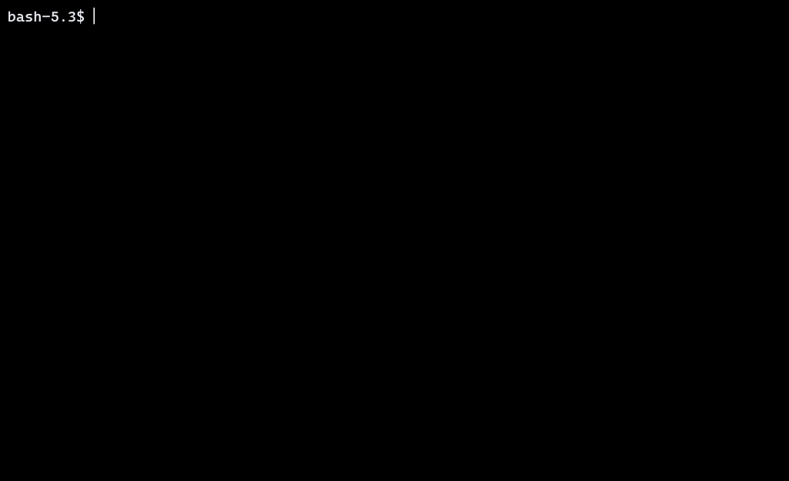
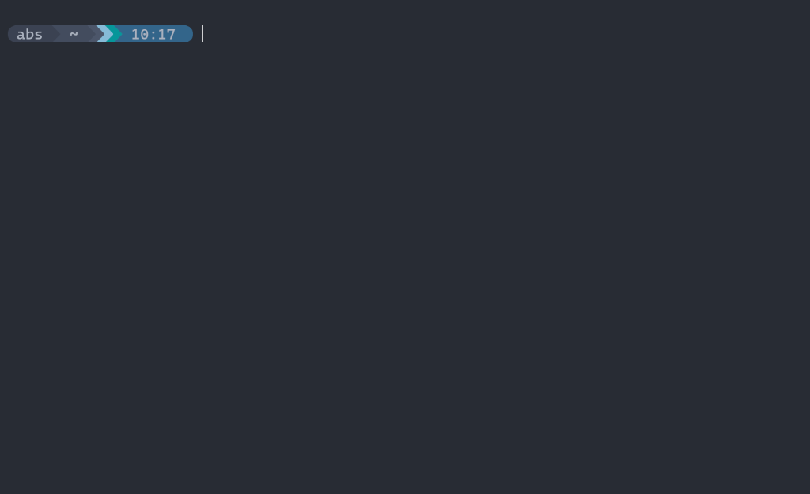

# DWM-Terminal (`dwmterm`)

<p align="center">
  <strong>An ultra-minimal, sub-millisecond latency CPU-framebuffer terminal engineered for dynamic window managers, Suckless <code>dwm</code>, and <a href="https://github.com/ChrisTitusTech/dwm-titus"><code>dwm-titus</code></a>.</strong>
</p>

<p align="center">
  
  
  
  
  
  
</p>

<p align="center">
  &nbsp;
  
</p>

---

## ⚡ Why DWM-Terminal?

Modern terminal emulators (Alacritty, Kitty, WezTerm, Ghostty) rely on heavy GPU rendering pipelines, OpenGL/Vulkan contexts, and large language runtimes (Rust, Zig, Lua) that consume **60–180 MB of RAM** per instance. Conversely, classic minimalist terminals like `st` require source-code patch stacks just to obtain basic conveniences like scrollback, font zooming, and clipboard sharing.

**`dwmterm` delivers the best of both worlds:**
- **Zero GPU Overhead**: Renders through direct **MIT-SHM shared memory CPU framebuffers**, avoiding compositor latency, GPU context switching, and rendering glitches.
- **Microscopic Footprint**: ~**12 MB Resident Set Size (RSS)** and a compiled static binary size of just **56 KB**.
- **Built-in Power Features**: Native PTY "time machine" scrubber, dynamic runtime font zoom, bundled **Meslo Nerd Font**, and native dynamic theming.

---

## 🚀 Key Features

* **⚡ MIT-SHM Shared Memory Blitting**: Bypasses raw X11 socket overhead by rendering directly into shared framebuffer memory via `XShmPutImage`, achieving over 45,000 lines/sec burst ingestion.
* **🪟 Native DWM Swallowing**: Pre-configured `WM_CLASS` (`dwmterm` / `Dwmterm`) designed for instant, zero-friction window swallowing in `dwm` (`isterminal = 1`).
* **🎨 Quickshell & DWM Bar Integration**: Sets compliant EWMH properties (`_NET_WM_PID`, UTF-8 `_NET_WM_NAME`) and embeds 32-bit ARGB window icons (`_NET_WM_ICON` at 16×16 and 32×32) for native taskbars and Quickshell widgets.
* **⏱️ Interactive PTY Flight Recorder ("Time Machine")**: Press `F1` at any time to freeze terminal state and scrub backwards through your session history with an on-screen HUD scrubber, or export your session to asciinema v2 `.cast` format.
* **🔡 Bundled Meslo Nerd Font**: Ships with official `MesloLGS Nerd Font` and automatically installs system-wide to `/usr/local/share/fonts/TTF/` with fontconfig cache refresh, making it instantly usable by DWM, Quickshell, and dmenu.
* **📐 DPI-Aware Typography**: Dynamic display DPI detection ensures true typographical point scaling, with strict monospace fallback filtering.
* **🎨 Dynamic Palette & Theming**: Built-in standard 16-color ANSI palette on pitch black background (`#000000`) with runtime reload support via `${XDG_CONFIG_HOME:-~/.config}/dwmterm/colors` and `SIGUSR1`, integrating seamlessly with `dwm-titus`'s `themes.toml` and `theme-apply.sh`.
* **🖥️ Alternate Screen & ANSI Truecolor**: Full 24-bit RGB truecolor support, `DECSET 1049/1047/47` alternate buffer swapping for `vim`, `htop`, `tmux`, and smooth mouse wheel translation.
* **📋 X11 Selection & OSC 52**: Click-and-drag mouse highlighting, PRIMARY middle-click paste, and bidirectional OSC 52 clipboard synchronization.

---

## 📊 Performance Comparison

| Metric | `dwmterm` | `st` (patched) | `Alacritty` | `Kitty` |
| :--- | :--- | :--- | :--- | :--- |
| **Architecture** | C99 (MIT-SHM) | C99 (Xlib) | Rust (OpenGL) | C/Python (OpenGL) |
| **Idle Memory (RSS)** | **~12 MB** | ~14 MB | ~65 MB | ~95 MB |
| **Binary Size** | **56 KB** | ~48 KB | ~18 MB | ~35 MB |
| **GPU Dependency** | **None** | None | Yes (OpenGL) | Yes (OpenGL) |
| **DWM Swallowing** | **Built-in** | Requires patch | Manual config | Incompatible |
| **Flight Recorder HUD** | **Built-in (F1)** | None | None | None |
| **Font Bundling** | **Meslo Nerd Font** | System-only | System-only | System-only |

---

## 🛠️ Installation

### 1. Install Dependencies

**Arch Linux / CachyOS / Manjaro:**
```bash
sudo pacman -S gcc make pkgconf libx11 libxext freetype2 fontconfig
```

**Debian / Ubuntu / Linux Mint / Pop!_OS:**
```bash
sudo apt install build-essential pkg-config libx11-dev libxext-dev libfreetype6-dev libfontconfig1-dev
```

**Fedora / RHEL:**
```bash
sudo dnf install gcc make pkgconf-pkg-config libX11-devel libXext-devel freetype-devel fontconfig-devel
```

### 2. Build & Install

```bash
git clone https://github.com/Abs313a/dwmterm.git
cd dwmterm
make
sudo make install
```

To install to a custom directory or package staging root:
```bash
make install PREFIX=/usr DESTDIR=/tmp/pkg-root
```

To uninstall:
```bash
sudo make uninstall
```

---

## 🪟 DWM Integration

### dwm-titus (`window-rules.toml` & `hotkeys.toml`)

In [dwm-titus](https://github.com/ChrisTitusTech/dwm-titus), configuration is parsed dynamically from TOML (zero recompilation needed):

1. **Window Swallowing (`window-rules.toml`):**
   Add `Dwmterm` to your `window-rules.toml`:
   ```toml
   rules = [
     { class="Dwmterm", isterminal=1 },
   ]
   ```

2. **Spawn Shortcut (`hotkeys.toml`):**
   In `dwm-titus`, the Windows / Super key is referenced as `"SUPER"`. Bind `dwmterm` to `Super + Return`:
   ```toml
   { mod="SUPER", key="Return", desc="Terminal", func="spawn", exec=["dwmterm"] }
   ```

### Vanilla DWM (`config.h`)

In traditional `dwm`, define `MODKEY` as `Mod4Mask` (Super / Windows key) and add the swallowing rule and spawn binding in `config.h`:

```c
/* Mod4Mask = Super/Windows key (recommended), Mod1Mask = Alt key (suckless default) */
#define MODKEY Mod4Mask

static const Rule rules[] = {
    /* class      instance    title       tags mask     isfloating   isterminal noswallow monitor */
    { "Dwmterm",  NULL,       NULL,       0,            0,           1,         0,        -1 },
};

static const char *termcmd[] = { "dwmterm", NULL };

static Key keys[] = {
    { MODKEY, XK_Return, spawn, {.v = termcmd } },
};
```

### Hyprland / Wayland Integration

When running under Wayland compositors (such as Hyprland) that manage universal clipboard shortcuts, tag `dwmterm` as a terminal in your window rules so the compositor forwards `CTRL + Insert` / `SHIFT + Insert` rather than intercepting `SUPER + C` as `CTRL + C` (`^C`):

**`~/.config/hypr/hyprland.conf`:**
```ini
windowrulev2 = tag +terminal, class:^([dD]wmterm)$
```

---

## ⌨️ Keybindings Reference

| Keybinding | Action |
| :--- | :--- |
| `F1` / `Ctrl` + `Shift` + `R` | **Toggle Flight Recorder ("Time Machine") Scrubber** |
| `Left` / `Right` | Step backward / forward through terminal timeline (in scrubber mode) |
| `Home` / `End` | Jump to beginning / return to live output (in scrubber mode) |
| `Escape` / `q` | Exit scrubber mode and return to interactive prompt |
| `Ctrl` + `Shift` + `C` / `Super` + `C` / `Ctrl` + `Insert` | Copy selection to CLIPBOARD |
| `Ctrl` + `Shift` + `V` / `Super` + `V` / `Shift` + `Insert` | Paste from CLIPBOARD |
| `Mouse Left Drag` | Highlight text to copy (PRIMARY & CLIPBOARD) |
| `Mouse Middle Click`| Paste text from PRIMARY selection |
| `Ctrl` + `+` (or `=`) | Increase font size by 2pt |
| `Ctrl` + `-` | Decrease font size by 2pt |
| `Ctrl` + `0` | Reset font size to default configured size |
| `Shift` + `PageUp` | Scroll up in terminal history |
| `Shift` + `PageDown` | Scroll down in terminal history |
| `Shift` + `Return` | Send CSI-u modified Return (`\e[13;2u`) |
| `Alt` + `Shift` + `Return` | Send CSI-u modified Return (`\e[13;4u`) |

---

## 💻 Command-Line Usage

```
Usage: dwmterm [options] [-e <cmd> [args...]]

Options:
  -e <cmd> [args...]             Execute command with arguments instead of shell
  -T, -t <title>                 Override initial window title
  -d, --working-directory <dir>  Set starting working directory
  -s, --font-size <pt>           Set initial font size in points (6-72)
  -f, --font <family>            Set font family name
  -p, --padding <px>             Set internal window padding in pixels (0-100)
  -v, --version                  Display version information and exit
  -h, --help                     Display this help message and exit
```

Examples:
```bash
# Launch a dedicated top monitor
dwmterm -T "Process Monitor" -e btop

# Open terminal in a specific directory (e.g. file manager action)
dwmterm --working-directory /var/log

# Run a detached build log
dwmterm -e make -j4

# Launch into standard shell
dwmterm
```

---

## ⚙️ Configuration

`dwmterm` supports persistent user preferences in `${XDG_CONFIG_HOME:-~/.config}/dwmterm/config`:

```ini
# ~/.config/dwmterm/config

# Typography
font_size = 12
font_family = MesloLGS Nerd Font

# Window Padding (internal margins in pixels)
# padding_x = 14
# padding_y = 14

# Cursor Styling & Blinking
# cursor_style = block       # bar (beam), block, or underline
# cursor_blink = true        # true or false (500ms cycle)

# Custom Keybindings
# Supported modifiers: super / mod / mod4 / win / cmd, ctrl, shift, alt / mod1
# Supported actions:   copy, paste, none (unbind)
# keybind = super+c = copy
# keybind = super+v = paste
```

### Settings Reference

#### Typography & Layout
* `font_size` (`-s, --font-size <pt>`): Font size in points (6–72, default: 12), scaled automatically to match display DPI.
* `font_family` (`-f, --font <family>`): Primary font family name with strict monospace fallback cascade.
* `padding` (`-p, --padding <px>`): Uniform internal window margin in pixels (0–100, default: 12).
* `padding_x` / `window-padding-x`: Independent horizontal window margin in pixels.
* `padding_y` / `window-padding-y`: Independent vertical window margin in pixels.

#### Cursor Styling & Animation
* `cursor_style` (`cursor-style`, `cursor_shape`): Visual cursor shape:
  * `bar` / `beam` / `line` (default vertical beam)
  * `block` (solid rectangular cell)
  * `underline` (horizontal bottom rule)
* `cursor_blink` (`cursor-blink`, `cursor-style-blink`): Enable or disable cursor blinking (`true` / `false`). Runs a 500ms blink interval and automatically snaps back to solid visible on keypress or incoming PTY stream.
* **DECSCUSR Standard Compliance:** Escape sequences like `DECSCUSR 0` (`\e[0 q`) dynamically revert to your configured cursor style and blink preference rather than forcing a terminal reset to default beam.

#### Keybindings & Modifier Auto-Discovery
* `keybind = <combo> = <action>`: Assign a key combination to an action (`copy` or `paste`). Multiple lines can be defined.
* `keybind = <combo> = none`: Unbind a default or custom shortcut.
* **Supported Modifiers:** `super`, `mod`, `mod4`, `win`, `cmd`, `ctrl`, `shift`, `alt`, `mod1`.
* **Automatic Detection:** `dwmterm` automatically queries `XGetModifierMapping` at startup to detect which modifier index maps to `Super` / `Mod4` and `Alt` / `Mod1`, guaranteeing exact matching on X11 and XWayland.
* **Lock Sanitization:** Key press evaluation strips CapsLock (`LockMask`) and NumLock (`Mod2Mask`) so shortcuts trigger consistently even when locks are enabled.

### CLI Overrides
```bash
dwmterm -s 14                         # Launch with custom 14pt font size
dwmterm -f "JetBrainsMono Nerd Font"  # Launch with custom font
dwmterm -p 16                         # Launch with 16px internal padding
dwmterm -d ~/Projects                 # Launch in specific directory
dwmterm -T "Server Log" -e htop       # Launch with custom title running a command
```

---

## 🎨 Theme & Palette Customization

`dwmterm` defaults to a pitch black background (`#000000`) and standard 16-color ANSI palette with a fixed white cursor out-of-the-box. It automatically detects and hot-reloads active desktop themes (such as `dwm-titus` or dynamic system palettes).

To force a static color palette override, define your palette in `${XDG_CONFIG_HOME:-~/.config}/dwmterm/colors` (a starter template is available in `colors.example`):

```ini
# ~/.config/dwmterm/colors
background   = #000000
foreground   = #E5E5E5
selection    = #444444
selection_fg = #FFFFFF

color0  = #000000
color1  = #CD0000
color2  = #00CD00
color3  = #CDCD00
color4  = #0000EE
color5  = #CD00CD
color6  = #00CDCD
color7  = #E5E5E5
color8  = #7F7F7F
color9  = #FF0000
color10 = #00FF00
color11 = #FFFF00
color12 = #5C5CFF
color13 = #FF00FF
color14 = #00FFFF
color15 = #FFFFFF
```

### Live Theme Reloading
To reload colors on-the-fly across all running `dwmterm` windows without restarting or losing session state:
```bash
kill -SIGUSR1 $(pgrep -x dwmterm)
```


---

## 📜 License

Distributed under the MIT License. See `LICENSE` for details.
