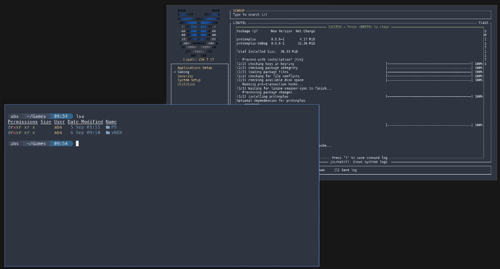

# DWM-Terminal (`dwmterm`)

<p align="center">
  <strong>An ultra-minimal, sub-millisecond latency CPU-framebuffer terminal engineered for dynamic window managers, Suckless <code>dwm</code>, and <a href="https://github.com/ChrisTitusTech/dwm-titus"><code>dwm-titus</code></a>.</strong>
</p>

<p align="center">
  
  
  
  
  
  
</p>

<p align="center">
  
</p>

---

## ⚡ Why DWM-Terminal?

Modern terminal emulators (Alacritty, Kitty, WezTerm, Ghostty) rely on heavy GPU rendering pipelines, OpenGL/Vulkan contexts, and large language runtimes (Rust, Zig, Lua) that consume **60–180 MB of RAM** per instance. Conversely, classic minimalist terminals like `st` require source-code patch stacks just to obtain basic conveniences like scrollback, font zooming, and clipboard sharing.

**`dwmterm` delivers the best of both worlds:**
- **Zero GPU Overhead**: Renders through direct **MIT-SHM shared memory CPU framebuffers**, avoiding compositor latency, GPU context switching, and rendering glitches.
- **Microscopic Footprint**: ~**12 MB Resident Set Size (RSS)** and a compiled static binary size of just **56 KB**.
- **Built-in Power Features**: Native PTY "time machine" scrubber, dynamic runtime font zoom, bundled **Meslo Nerd Font**, and native dynamic theming.

---

## 🚀 Key Features

* **⚡ MIT-SHM Shared Memory Blitting**: Bypasses raw X11 socket overhead by rendering directly into shared framebuffer memory via `XShmPutImage`, achieving over 45,000 lines/sec burst ingestion.
* **🪟 Native DWM Swallowing**: Pre-configured `WM_CLASS` (`dwmterm` / `Dwmterm`) designed for instant, zero-friction window swallowing in `dwm` (`isterminal = 1`).
* **🎨 Quickshell & DWM Bar Integration**: Sets compliant EWMH properties (`_NET_WM_PID`, UTF-8 `_NET_WM_NAME`) and embeds 32-bit ARGB window icons (`_NET_WM_ICON` at 16×16 and 32×32) for native taskbars and Quickshell widgets.
* **⏱️ Interactive PTY Flight Recorder ("Time Machine")**: Press `F1` at any time to freeze terminal state and scrub backwards through your session history with an on-screen HUD scrubber, or export your session to asciinema v2 `.cast` format.
* **🔡 Bundled Meslo Nerd Font**: Ships with official `MesloLGS Nerd Font` and automatically installs system-wide to `/usr/local/share/fonts/TTF/` with fontconfig cache refresh, making it instantly usable by DWM, Quickshell, and dmenu.
* **🎨 Dynamic Palette & Theming**: Built-in Arctic Nord palette with runtime reload support via `${XDG_CONFIG_HOME:-~/.config}/dwmterm/colors` and `SIGUSR1`, integrating seamlessly with `dwm-titus`'s `themes.toml` and `theme-apply.sh`.
* **🖥️ Alternate Screen & ANSI Truecolor**: Full 24-bit RGB truecolor support, `DECSET 1049/1047/47` alternate buffer swapping for `vim`, `htop`, `tmux`, and smooth mouse wheel translation.
* **📋 X11 Selection & OSC 52**: Click-and-drag mouse highlighting, PRIMARY middle-click paste, and bidirectional OSC 52 clipboard synchronization.

---

## 📊 Performance Comparison

| Metric | `dwmterm` | `st` (patched) | `Alacritty` | `Kitty` |
| :--- | :--- | :--- | :--- | :--- |
| **Architecture** | C99 (MIT-SHM) | C99 (Xlib) | Rust (OpenGL) | C/Python (OpenGL) |
| **Idle Memory (RSS)** | **~12 MB** | ~14 MB | ~65 MB | ~95 MB |
| **Binary Size** | **56 KB** | ~48 KB | ~18 MB | ~35 MB |
| **GPU Dependency** | **None** | None | Yes (OpenGL) | Yes (OpenGL) |
| **DWM Swallowing** | **Built-in** | Requires patch | Manual config | Incompatible |
| **Flight Recorder HUD** | **Built-in (F1)** | None | None | None |
| **Font Bundling** | **Meslo Nerd Font** | System-only | System-only | System-only |

---

## 🛠️ Installation

### 1. Install Dependencies

**Arch Linux / CachyOS / Manjaro:**
```bash
sudo pacman -S gcc make pkgconf libx11 libxext freetype2 fontconfig
```

**Debian / Ubuntu / Linux Mint / Pop!_OS:**
```bash
sudo apt install build-essential pkg-config libx11-dev libxext-dev libfreetype6-dev libfontconfig1-dev
```

**Fedora / RHEL:**
```bash
sudo dnf install gcc make pkgconf-pkg-config libX11-devel libXext-devel freetype-devel fontconfig-devel
```

### 2. Build & Install

```bash
git clone https://github.com/Abs313a/dwmterm.git
cd dwmterm
make
sudo make install
```

To install to a custom directory or package staging root:
```bash
make install PREFIX=/usr DESTDIR=/tmp/pkg-root
```

To uninstall:
```bash
sudo make uninstall
```

---

## 🪟 DWM Integration

### dwm-titus (`window-rules.toml`)
In [dwm-titus](https://github.com/ChrisTitusTech/dwm-titus), window rules are parsed dynamically from TOML (zero recompilation needed). Add `Dwmterm` to your `window-rules.toml`:

```toml
rules = [
  { class="Dwmterm", isterminal=1 },
]
```

### Vanilla DWM (`config.h`)
In traditional `dwm`, add the swallowing rule to `config.h`:

```c
static const Rule rules[] = {
    /* class      instance    title       tags mask     isfloating   isterminal noswallow monitor */
    { "Dwmterm",  NULL,       NULL,       0,            0,           1,         0,        -1 },
};
```

To spawn `dwmterm` with your modifier keybinding (e.g. `Mod4 + Return`):
```c
static const char *termcmd[] = { "dwmterm", NULL };

static Key keys[] = {
    { MODKEY, XK_Return, spawn, {.v = termcmd } },
};
```

*(See [DWM_TITUS.md](DWM_TITUS.md) for full upstream integration steps covering Quickshell, scripts/dwm-terminal, and default applications.)*

---

## ⌨️ Keybindings Reference

| Keybinding | Action |
| :--- | :--- |
| `F1` | **Toggle Flight Recorder ("Time Machine") Scrubber** |
| `Left` / `Right` | Step backward / forward through terminal timeline (in scrubber mode) |
| `Home` / `End` | Jump to beginning / return to live output (in scrubber mode) |
| `Escape` / Any key | Exit scrubber mode and return to interactive prompt |
| `Ctrl` + `+` (or `=`) | Increase font size by 2pt |
| `Ctrl` + `-` | Decrease font size by 2pt |
| `Ctrl` + `0` | Reset font size to default (10pt) |
| `Shift` + `PageUp` | Scroll up in terminal history |
| `Shift` + `PageDown` | Scroll down in terminal history |
| `Mouse Left Drag` | Highlight text to copy (PRIMARY & CLIPBOARD) |
| `Mouse Middle Click`| Paste text from PRIMARY selection |

---

## 💻 Command-Line Usage

```
Usage: dwmterm [options] [-e <cmd> [args...]]

Options:
  -e <cmd> [args...]             Execute command with arguments instead of shell
  -T, -t <title>                 Override initial window title
  -d, --working-directory <dir>  Set starting working directory
  -v, --version                  Display version information and exit
  -h, --help                     Display this help message and exit
```

Examples:
```bash
# Launch a dedicated top monitor
dwmterm -T "Process Monitor" -e btop

# Open terminal in a specific directory (e.g. file manager action)
dwmterm --working-directory /var/log

# Run a detached build log
dwmterm -e make -j4

# Launch into standard shell
dwmterm
```

---

## 🎨 Theme & Palette Customization

`dwmterm` defaults to the Arctic Nord 16-color palette out-of-the-box. To customize colors or integrate with external theme managers (such as `dwm-titus`'s `theme-apply.sh`), define your palette in `${XDG_CONFIG_HOME:-~/.config}/dwmterm/colors`:

```ini
# ~/.config/dwmterm/colors
background  = #2E3440
foreground  = #ECEFF4
cursor      = #88C0D0

color0  = #3B4252
color1  = #BF616A
color2  = #A3BE8C
color3  = #EBCB8B
color4  = #81A1C1
color5  = #B48EAD
color6  = #88C0D0
color7  = #E5E9F0
color8  = #4C566A
color9  = #BF616A
color10 = #A3BE8C
color11 = #EBCB8B
color12 = #81A1C1
color13 = #B48EAD
color14 = #8FBCBB
color15 = #ECEFF4
```

### Live Theme Reloading
To reload colors on-the-fly across all running `dwmterm` windows without restarting or losing session state:
```bash
kill -SIGUSR1 $(pgrep -x dwmterm)
```


---

## 📜 License

Distributed under the MIT License. See `LICENSE` for details.
